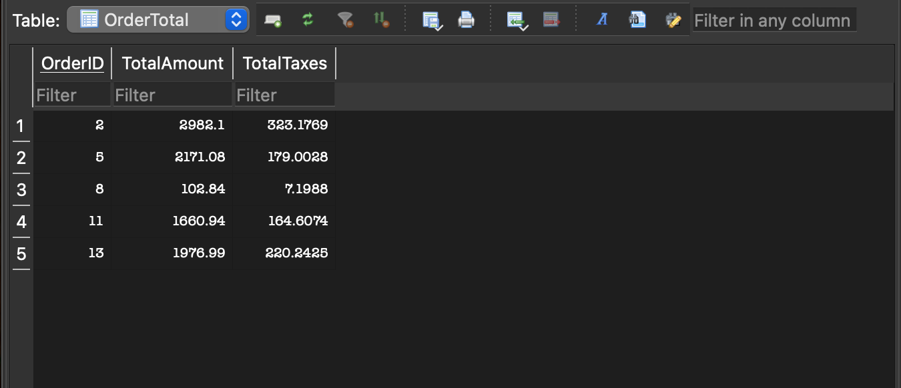
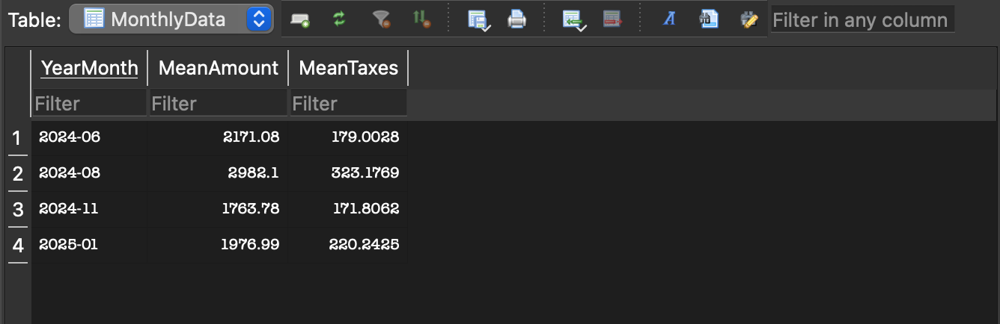

# ETL Project

- [Project Overview](#project-overview)
- [Project Structure](#project-structure)
- [Setup and Usage](#setup-and-usage)
    - [Prerequisites](#prerequisites)
    - [Running the ETL Pipeline](#running-the-etl-pipeline)
- [Development Report](#etl-development-report)

## Project Overview
This project implements an **ETL (Extract, Transform, Load) pipeline** for processing E-commerce data. It performs the following steps:

- **Extract:** Fetches data via HTTP from a deployed REST API.
- **Transform:** Processes the extracted data to generate insights.
- **Load:** Saves the transformed data in **CSV** and **SQLite database** formats for further use.

## Project Structure

```
/rest_api   → Python-based REST API serving E-commerce data, deployed on an AWS EC2 instance.

/etl        → OCaml-based ETL pipeline that fetches, processes, and stores data locally.

/etl/results → Output directory containing the processed CSV and SQLite database files.
```

## Setup and Usage

### Prerequisites
Ensure you have the following dependencies installed before running the project:

- **OCaml Tooling:** [`dune`](https://dune.build/) (build system)
- **Libraries:**
  - [`cohttp-lwt-unix`](https://github.com/mirage/ocaml-cohttp) (HTTP requests)
  - [`yojson`](https://github.com/ocaml-community/yojson) (JSON parsing)
  - [`csv`](https://github.com/Chris00/ocaml-csv) (CSV generation)
  - [`sqlite3`](https://github.com/mmottl/sqlite3-ocaml) (Database interactions)
  - [`alcotest`](https://github.com/mirage/alcotest) (Unit testing framework)

### Running the ETL Pipeline

1. Navigate to the ETL project directory:
   ```sh
   cd etl
   ```

2. Create a switch using **ocaml-base-compiler.5.3.0** and activate it
  ```sh
  opam switch create my_custom_switch ocaml-base-compiler.5.3.0
  ```

  ```sh
    eval $(opam env)
  ```

3 Installing the dependencies, it will use the file `etl/etl.opam` to install the dependencies
  ```sh
  opam install . --deps-only
  ```

4. Build the project:
   ```sh
   dune build
   ```

5. Execute the ETL process:
   ```sh
   dune exec etl
   ```

6. Follow the terminal instructions. Once the execution is complete, the processed files will be available in:
  
   `etl/results/`

6. To run unit tests run:
  ```sh
   dune test
  ```
   

## ETL Development Report

This report outlines the development process of the project, detailing the steps taken to implement the required functionalities. It serves as a guide for anyone looking to replicate or extend the project in the future. This project was implemented in OCaml and adheres to functional programming principles.

### 1. Create Python API
A Python API was developed to serve order and order item data. This API is responsible for exposing endpoints that return order details in JSON format.

API endpoints:
- Order: http://44.200.31.239:8000/order
- OrderItem: http://44.200.31.239:8000/orderItem

### 2. Set Up Project Structure

1. Installed `dune` and created the basic project structure using it.
2. Manually created directories to organize the project, separating concerns between:
   - `lib/` → for the main execution file
   - `controller/` → for fetching data logic
   - `service/` → for all processing data logic
   - `test/` → for testing

### 3. Fetch and Parse Data

**Fetching Data:** The ETL process retrieves order and order item data via HTTP GET requests using OCaml Cohttp for HTTP handling.

**Parsing JSON:** The HTTP response is parsed into JSON objects with the Yojson.Safe module.

**Defining Data Structures:**

OCaml record types `order` and `order_item` were created to model the extracted data:

```ocaml
type order = {
  id : int;
  client_id : int;
  order_date : string;
  status : string;
  origin : char;
}

type order_item = {
  order_id : int;
  product_id : int;
  quantity : int;
  price : float;
  tax : float;
}
```

Conversion functions were implemented to map JSON data to these OCaml types.

### 4. Perform Inner Join
- Defined a new type, `order_order_item`, to represent the result of joining orders and order items:

  ```ocaml
  type order_order_item = {
    order : order;
    order_item : order_item;
  }
  ```

- Used list processing functions (`List.fold_left`, `List.map`, and `List.filter`) to match items by `order_id` and generate a combined list of enriched records.
- It is an inner join, so one order type can be combined with N order_item types.

### 5. Capture User Input for Filtering
- Implemented command-line input capture to filter data based on `status` and `origin`.
- Used standard OCaml `read_line` for user input and employed `List.filter` to apply the constraints dynamically.

### 6. Compute Order Total
- Defined a type representing the final aggregated results:

  ```ocaml
  type order_total = {
    order_id : int;
    total_amount : float;
    total_taxes : float;
  }
  ```
  
- Transformed `order_order_item` list into `order_total` list.
- Grouped order_item by order_id, aggregating data related to price, quantity, and tax to calculate total_amount and total_taxes.

**Detailed implementation:**
1. Using IntSet, created a list of unique order_id's.
2. Iterated over this unique order_id's list using `List.fold_left` with an empty list as the accumulator representing the order_total list.
3. For every unique order_id, filtered order_items that had the same order_id and iterated over them using an inner `List.fold_left` where the accumulator tracked total_amount and total_taxes.
4. Using the inner `List.fold_left` accumulator return, created an order_total record and appended it to the order_total list accumulator.

### 7. Compute Additional Monthly Summary
- Introduced a new type to store mean amount and mean tax per month:

  ```ocaml
  type monthly_mean = {
    year_month: string;
    mean_amount: float;
    mean_tax: float;
  }
  ```
        
- Transformed `order_order_item` list into `monthly_mean` list.
- Grouped order_item by yyyy-mm, aggregating data related to price, quantity, and tax to calculate total_amount and total_taxes, while also tracking the number of orders in that month to calculate the mean_amount and mean_tax.

**Detailed implementation:**
1. Using StringSet, created a list of unique yyyy-mm values.
2. Iterated over this unique yyyy-mm list using `List.fold_left`, with an empty list as accumulator representing the monthly_mean list, and calculated the number of orders in each month.
3. For every unique yyyy-mm, filtered order_items with the same yyyy-mm and iterated over them using an inner `List.fold_left` where the accumulator tracked total_amount and total_taxes.
4. Using the inner `List.fold_left` accumulator return, calculated the mean and created a monthly_mean record, appending it to the monthly_mean list accumulator.

### 8. Save Data to CSV
- Utilized the [OCaml CSV Library](https://ocaml.org/p/csv/2.4) to write processed data to CSV files.
- Implemented a function to transform OCaml records into CSV-compatible `string lists`.
- Then used the library to transform these `string lists` representations into CSV files.
- **Bonus**: Discovered bugs in the official documentation and contributed to open source by creating an issue detailing the problem: [Issue Link](https://github.com/ocaml/ocaml.org/issues/3043).
- Results are stored at: `etl/results/csv`


### 9. Save Data to SQLite
- Designed a schema for storing order_total data and monthly_mean data in an SQLite database.
- Used [OCaml SQLite3 Library](https://ocaml.org/p/sqlite3/5.1.0/doc/Sqlite3/index.html).
- Created one table for each type representation.
- Created functions that map record lists into SQL insertion value strings.
- Executed the SQL statements.
- Results are stored at: `etl/results/sqlite/store_db.sqlite3`

Results inspected using DB Browser for SQLite:

Order_total table:



Monthly_mean table:



### 10. Document Functions
- All functions were documented using structured docstrings.
- Inside the docstring is the information if the function is pure or not.
- AI assistance was used to generate the docstrings for each function.

### 11. Implement Unit Tests
- Complete unit tests were written for all pure functions using `Alcotest`.
- Leveraged insights from:
  - [Running Tests with Dune](https://ocaml.org/docs/running-executables-and-tests-with-dune)
  - [Dune Testing Guide](https://dune.readthedocs.io/en/stable/tests.html)

## Use of Generative AI
Generative AI was used in specific parts of the project:
- Assisting with Python API creation.
- Generating docstring documentation for functions.
- Helping generate complete unit tests.
- Helping in creation of README.md.

## Optional Requirements Checklist
- [x] Read input data from a static file on the internet (exposed via HTTP).
- [x] Save output data in an SQLite database.
- [x] Process input tables separately but preferably perform an inner join before transformation.
- [x] Organize the ETL project using `dune`.
- [x] Document all functions using docstring format.
- [x] Provide an additional output containing the average revenue and taxes paid, grouped by month and year.
- [x] Generate comprehensive test files for pure functions.

### Bonus Deliverables
- [x] Deployed an API that serves data over the internet.
- [x] Parsed HTTP requests into JSON.
- [x] During development, found errors in the CSV library documentation and created an issue reporting it.
